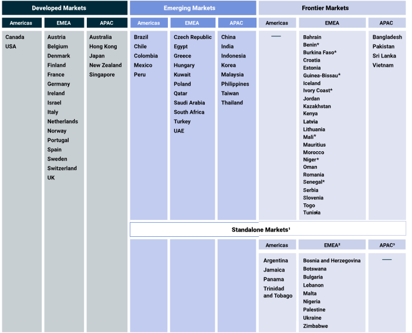
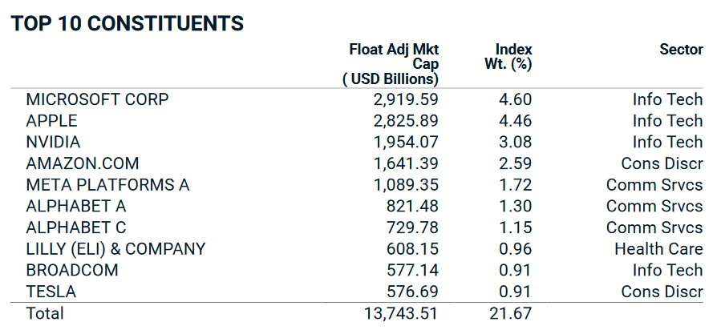

import BuyMeACoffee from '@site/src/components/BuyMeACoffee';

# ETFs vs stocks

This page is still a work in progress, stay tuned for more details!

## ETFs

ETF (Exchange Traded Funds) are investment securities traded like any other stock.
However, when buying a share of an ETF, you are actually buying a basket of stocks instead of a single one.

These "baskets" are called indexes, defined by index providers.

### Index providers

One of the largest index providers for such ETFs is a company called MSCI, and below is the classification of different markets. 

Among the most popular global MSCI indexes are:
- [MSCI World Index](https://www.msci.com/documents/10199/178e6643-6ae6-47b9-82be-e1fc565ededb): tracks the large and mid-cap from the 23 developed markets, covering 1480 companies in total (85% of each country's market capitalization).
- [MSCI ACWI Index](https://www.msci.com/documents/10199/8d97d244-4685-4200-a24c-3e2942e3adeb): tracks the large and mid-cap from the 23 developed markets + the 24 emerging markets, with around 3000 constituents representing 85% of the global investable market capitalization
- [MSCI ACWI IMI Index](https://www.msci.com/documents/10199/8d97d244-4685-4200-a24c-3e2942e3adeb): same as MSCI ACWI, but also covers small-cap, pushing the number of constituents above 9000, covering 99% of the global investable market capitalization

Another large index provider is FTSE:
- [FTSE Developed Index](https://research.ftserussell.com/Analytics/Factsheets/Home/DownloadSingleIssue?issueName=AWD&IsManual=false): subset of the FTSE All-World Index, with more than 2000 constituents in developed markets.
- [FTSE All-World Index](https://research.ftserussell.com/Analytics/Factsheets/Home/DownloadSingleIssue?issueName=AWORLDS&IsManual=false): more than 4000 constituents, covering 98% of the world's investable market capitalization.

Finally, the last one I will mention is Solactive, selected by Amundi for its "Prime" ETFs:
- [Solactive GBS Developed Markets Large & Mid Cap Index](https://www.solactive.com/Indices/?index=DE000SLA41D2): large and mid-cap from developed markets, around 1500 constituents (~85% of the market cap of these markets).
- [Solactive GBS Global Markets Large & Mid Cap Index](https://www.solactive.com/Indices/?index=DE000SLA7745): large and mid-cap from developed and emerging markets, around 3500 constituents (~85% of the market cap of these markets).

As you can see, different index providers have similar indexes.
| Index Provider 	|                        All*                        	|                       Developed                      	|                       Emerging                       	|
|---------------:	|:--------------------------------------------------:	|:-----------------------------------------------------:	|:----------------------------------------------------:	|
|           MSCI 	|                   MSCI ACWI Index                  	|                    MSCI World Index                   	|              MSCI Emerging Markets Index             	|
|           FTSE 	|                FTSE All-World Index                	|                  FTSE Developed Index                 	|                  FTSE Emerging Index                 	|
|      Solactive 	| Solactive GBS Global Markets Large & Mid Cap Index 	| Solactive GBS Developed Markets Large & Mid Cap Index 	| Solactive GBS Emerging Markets Large & Mid Cap Index 	|

### Index constituents

If you buy shares of an ETF tracking the MSCI World Index, here is part of what you are indirectly buying *(as of March 8th 2024)*:

If you buy for 1000€ of that ETF, it is equivalent to buying:
- 46.0€ of Microsoft
- 44.6€ of Apple
- 30.8€ of Nvidia
- 25.9€ of Amazon
- etc.

This is the main benefit of investing through ETFs: you can instantly diversify without having to buy hundreds of stocks yourself.

### Pros
- ETFs provide instant diversification: a single ETF can represent thousands of constituents.
- ETFs can provided exposure to specific countries, sectors, industries, without having to manually pick indivual stocks.
- ETFs are as easy to buy as stocks, and share prices are usually quite affordable.
- ETFs have low fees: traditionnal mutual funds usually underperform, charging annual fees that can be 10x those of ETFs.
- Accumulative ETFs automatically reinvest the dividends, avoiding any laborious tax filing.

<BuyMeACoffee />
