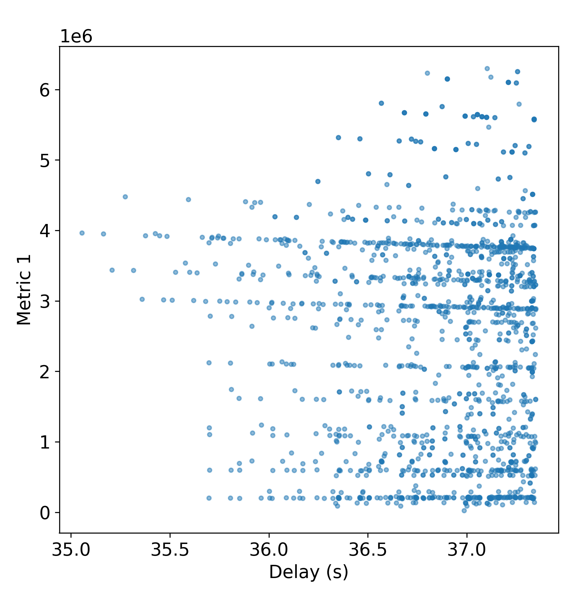

# TGV economic performance optimization

## Dynamic Programming

Dynamic programming is an optimization method based on breaking down a big problem into smaller problems that are easier to solve.

In this project, the main benefits of using dynamic programming are the following:

- We don't know a priori what the shape of the solution would be, but we can formalize the problem, its constraints, and the metrics to be optimized.
- We can explore possible ways to operate the train, and keep track of the previous states of the search: we don't have to start from the beginning each time we run into a dead-end.
- We can generate more than one solution, and therefore explore trade-offs between energy savings and delay.

Therefore, we can think of dynamic programming as smart brute-force method. At each iteration we explore a most-promising node, and cut out the ones that are already breaking a constraint.

For instance, if we were to truly brute-force a 100-step problem with 5 possibilities for each node, we would have to generate an unthinkable number of paths:

$$
5^{100} = 7.88*10^{69}
$$

However, if the constraints we have set are actually restricting possibilities to an average of 1.1 possibilities for each node, we restrict the research space to:

$$
1.1^{100} = 1.38*10^4
$$

It was a brief introduction to dynamic programming, but hopefully you will get the intuition behind why it works.

## Optimization of the train operation

When it comes to optimizing the energy consumption of a train, we can breakdown the whole trip from point A to point B into shorter segments. Instead of optimizing a 100km trip directly, we can start by optimizing the first kilometer. The problem can be represented as a graph with a root node being the origin station, and a terminal node being the next station to reach. Nodes in between will be steps allowing to reach our goal (the terminal node).

A node consists of:

- Current speed: the speed at which the train will operate for the next segment.
- List of previous speeds: to keep track of the operation history.
- Trip duration: since departure from the root node.
- Traveled distance: from the root node.
- Consumed energy: this one metrics to be optimized compared to a reference.

After each segment, there will be a decision-making step: do we accelerate, decelerate or keep constant speed ? 

## Initialization of the problem

We start the optimization by generating the root node: all the properties of the node will be equal to zero. Then we generate children nodes based on reachable speeds within the next segment; with regards to laws of physics, and external constraints (maximum speed for instance). 

## Main loop

Until we reach the terminal node (or when $n$ paths are found), we will proceed as follows:

- Select the node with the best heuristic that we define (it can be the best delay to energy saved ratio)
- Generate a child for each reachable speed within the next segment, if all the constraints are still respected. Each child will have a different current speed, trip duration and consumed energy, but a common list of previous speeds as they are generated from the same parent.

## Solutions

We can either decide to end the search:

- as soon as we have found a solution
- as soon as we generated $n$ paths from the root node to the terminal node

The first one will indeed be the fastest option, but the second one will allow to get a set of different paths, having different delays and energy savings. From this set we can identify a pareto front of paths achieving best trade-offs.

## Results

*Optimized speed curve*

*One of the metrics tested (top left is better)*